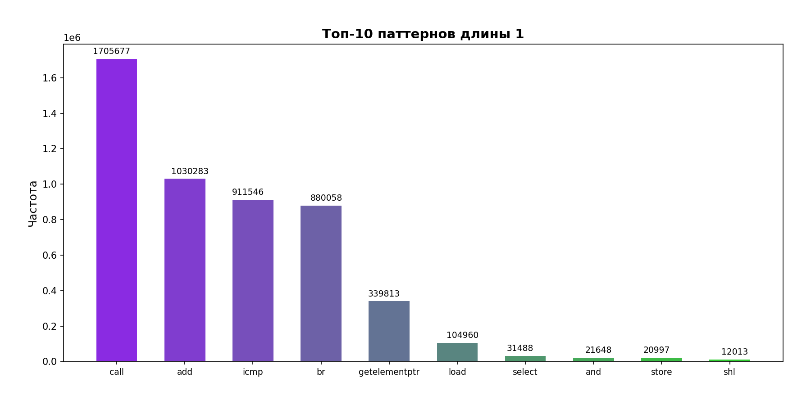
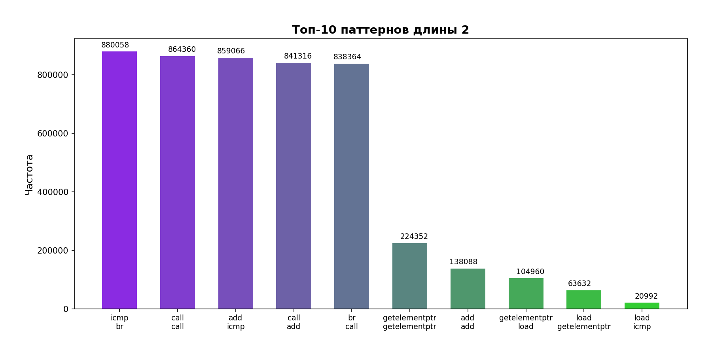
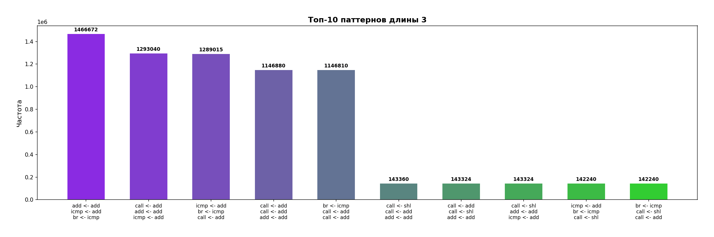
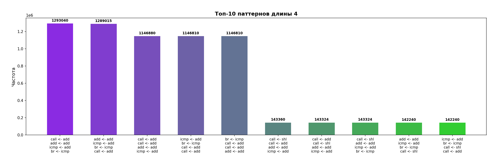
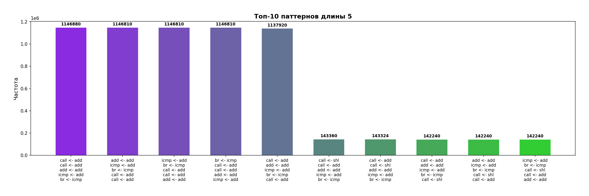
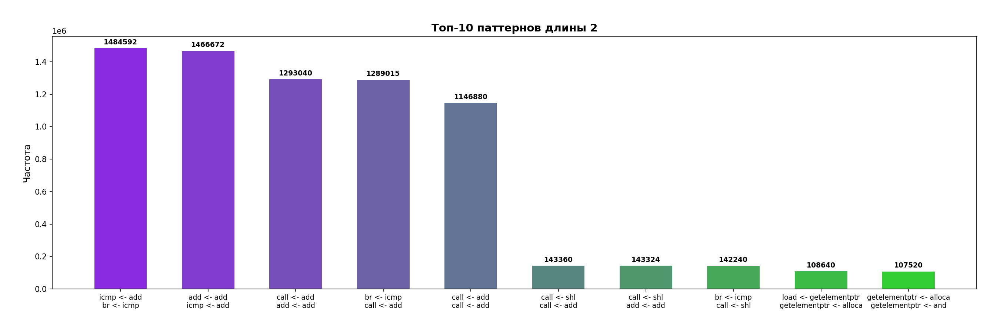
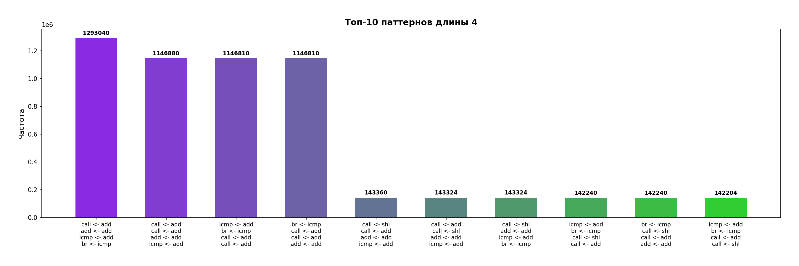
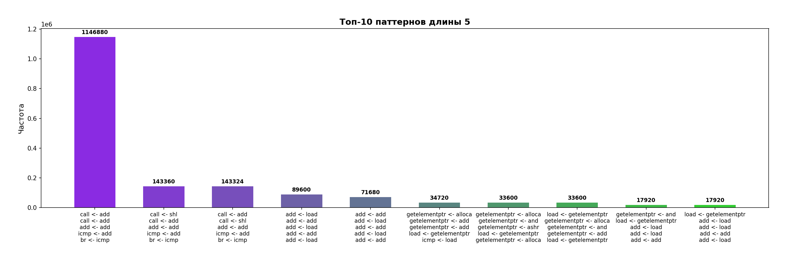

# LLVM Pass

## Описание

Это пример реализации LLVM пасса, который в runtime'е собирает трассу исполненных IR инструкций (`User <- Operand`) графического приложения (только для логического модуля `../01_SDL/src/app.c`) на `-O2`.

Если `User` это `phi`, то `User` не логируется. Если же `phi` является операндом в какой либо инструкции, то логируются интрукции, используемые в операндах этого `phi`.

**Пример**: запись `shl <- phi` заменяется на две записи `shl <- add` и `shl <- sub`, если этот `phi` использует в качестве операндов `add` и `sub`.

## Компиляция и запуск
1. Компиляция пасса:
```powershell
clang++ pass_trace.cpp -fPIC -shared -I$(llvm-config --includedir) -o libPass.so
```

2. Генерация LLVM IR из исходного C-кода:
```powershell
clang -O2 ../01_SDL/src/app.c -emit-llvm -S -o app.ll
```

3. Применение пасса к полученному IR:
```powershell
clang -O2 -fpass-plugin=./libPass.so app.ll -emit-llvm -S -o app.after_pass.ll
```

4. Компиляция и линковка финальной программы
```powershell
clang -O2 log.c app.after_pass.ll ../01_SDL/src/start.c ../01_SDL/src/sim.c -lSDL2 -o get_log.out
```
<br> 

Можно запустить скрипт `run.sh` для выполнения всех этих команд вместе:
```powershell
bash ./run.sh ../01_SDL/src/app.c ../01_SDL/src/start.c ../01_SDL/src/sim.c -lSDL2
```

На выходе получим файл `get_log.out`.


## Анализ результатов
Проведём анализ часто повторяемых паттернов (длину паттерна будем варьировать от 1 до 5 инструкций). 

Для этого получим `trace.log`:
```powershell
./get_log.out > trace.log
```

Стоить учесть, что приложение начинает подлагивать (а через некоторое время и вовсе зависнет) в силу того, что такое количество логирования требует значительных ресурсов ЦП. Не стоит ждать много времени работы приложения `get_log.out`, так как итоговый файл будем слишком большого объёма, что анализ никак не улучшит. В связи с этим, можно запустить `run.sh` с опциональным параметром `time=seconds`, где `seconds` - время в секундах работы программы (положительное целое число):
```powershell
bash ./run.sh ../01_SDL/src/app.c ../01_SDL/src/start.c ../01_SDL/src/sim.c -lSDL2 time=seconds
```

Теперь с помощью `analyze.py` получим статистику в виде графиков часто повторяемых паттернов:
```powershell
python3 analyze.py
```

**Итак, было получено:**
<br>







И, казалось бы, на этом можно закончить анализ. Но если посмотреть, например, на графики паттернов длины 4 или 5, то мы увидим ожидаемое, но в то же время странное поведение. Мы видим 5 столбцов одинаковой высоты ~1146880 и ещё 5 столбцов одинаковой высоты ~143360. 

В качестве примера посмотрим на такой формальный IR:
```bash
# повторение ABC...
A
B
C
A
B
C
A
B
C
# повторение ABC...
```

Если в этом примере начать собирать паттерны длины 3, то таких паттернов будет несколько (`ABC`, `BCA`, `CAB`). И вполне логично сказать, что на самом деле паттерны `ABC` и `BCA` пересекаются по общему блоку инструкций `ABCA`.

Если бы мы на самом деле хотели бы сжать паттерн инструкций в отдельную инструкцию, то у нас получилось бы это сделать только с набором инструкций `ABC` (в процессе сворачивания в одну инструкцию мы бы просто не добрались бы до других паттернов, так как после сворачивания `ABC`, всё, что нам остается, это снова свернуть `ABC`, и других паттернов возникнуть не может для свёртки, за исключением, быть может, головы и хвоста многократно повторяющегося паттерна). 

Иначе говоря: если новый найденный паттерн может получиться из уже существующего паттерна циклической перестановкой операций, то на самом деле речь идет об одном и том же паттерне.

В связи с вышенаписанным, изменим алгоритм `analyze.py`, собирающий статистику в графики. Если новый паттерн может быть циклическим сдвигом получен из уже существующего паттерна, мы будем считать это одним паттерном. Для этого можно запустить `smart_analyze.py`:
```powershell
python3 ./smart_analyze.py
```

**Итого:**
<br>







Теперь анализ стал более объективным, но ещё не до конца. Теперь рассмотрим пример, в котором паттерн повторяется не циклически как в примере выше. Он просто часто повторяется в коде паттерн в коде:
``` bash
X
Y
Z
X
# другой код...
X
Y
Z
X
# другой код...
X
Y
Z
X
```

Понятно, что паттерны `XYZ` и `YZX` будут иметь одинаковую частоту повторения, хотя вполне очевидно, что это часть одного и того же блока инструкций. И на деле единственным часто повторяющимся паттерном будет `XYZ`.

По графикам можно убедиться (столбцы с примерно одинаковой высотой, часть инструкций которых пересекается с точностью до порядка инструкций), что такие случаи действительно есть.

Но, признаться честно, я сильно устал, так что закончу пока что на этом...
