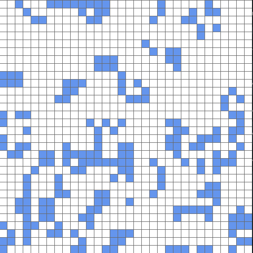

# Assembler to LLVM IR generator

## Описание
1) Написать свой набор инструкций из статистики для `ASM` и `LLVM IR` вашего графического приложения. 
2) Переписать приложение на `ASM`. 
3) Написать `ASM2IR` генератор:
    - С вызовами эмулирующих функций (кроме инструкций потока управления).
    - С генерацией IR-эквивалентов для всех инструкций.


## Ход работы
1) **Instruction Set Architecture**.

Набор ассемблерных команд на основе `LLVM IR`, `app.c` и второго задания `02_LLVM_PASS`, в котором была собрана статистика часто повторяющихся паттернов инструкций:

| **№** |    **Инструкция**    |              **Формат ASM**             |           **Назначение**           |                                       **LLVM IR-эквивалент**                                       |
|:-----:|:--------------------:|:---------------------------------------:|:----------------------------------:|:--------------------------------------------------------------------------------------------------:|
|   1   |        **ADD**       |          `ADD dst, src1, src2`          |        Сложение целых чисел        |                                    `%dst = add i32 %src1, %src2`                                   |
|   2   |       **ADDi**       |           `ADDi dst, src, imm`          |        Сложение с константой       |                                     `%dst = add i32 %src, imm`                                     |
|   3   |        **MOV**       |              `MOV dst, src`             |        Копирование регистра        |                                           `%dst = %src`                                           |
|   4   |       **MOVi**       |             `MOVi dst, imm`             |         Загрузка константы         |                                          `%dst = i32 imm`                                          |
|   5   |        **SHL**       |           `SHL dst, src, imm`           |             Сдвиг влево            |                                     `%dst = shl i32 %src, imm`                                     |
|   6   |        **OR**        |           `OR dst, src1, src2`          |           Побитовое "ИЛИ"          |                                    `%dst = or i32 %src1, %src2`                                    |
|   7   |        **AND**       |          `AND dst, src1, src2`          |            Побитовое "И"           |                                    `%dst = and i32 %src1, %src2`                                   |
|   8   |       **ANDi**       |           `ANDi dst, src, imm`          |     Побитовое "И" с константой     |                                     `%dst = and i32 %src, imm`                                     |
|   9   |      **CMP_EQ**      |          `CMP_EQ dst, src, imm`         |       Сравнение на равенство       |                                   `%dst = icmp eq i32 %src, imm`                                   |
|   10  |      **CMP_LT**      |          `CMP_LT dst, src, imm`         |         Сравнение "меньше"         |                                   `%dst = icmp slt i32 %src, imm`                                  |
|   11  |      **CMP_GT**      |          `CMP_GT dst, src, imm`         |         Сравнение "больше"         |                                   `%dst = icmp sgt i32 %src, imm`                                  |
|   12  |      **INC_EQ**      |          `INC_EQ dst, src, imm`         | Инкремент и сравнение на равенство |                     `%temp = add i32 %src, 1`  `%dst = icmp eq i32 %temp, imm`                     |
|   13  |      **BRANCH**      |              `BRANCH label`             |         Безусловный переход        |                                          `br label %label`                                         |
|   14  |      **BR_COND**     | `BR_COND cond, label_true, label_false` |          Условный переход          |                              `br i1 %cond, label %true, label %false`                              |
|   15  |       **ALGR**       |               `ALGR grid`               |  Выделение памяти под сетку 32x32  |                                 `%grid = alloca [32 x [32 x i32]]`                                 |
|   16  |      **MEMSET**      |               `MEMSET ptr`              |          Обнуление памяти          |                      `call void @llvm.memset.p0.i64(ptr %ptr, i8 0, i64 size)`                     |
|   17  |      **MEMCPY**      |            `MEMCPY dst, src`            |         Копирование памяти         |                  `call void @llvm.memcpy.p0.p0.i64(ptr %dst, ptr %src, i64 size)`                  |
|   18  |     **GET_CELL**     |        `GET_CELL grid, x, y, dst`       |      Получение значения клетки     | `%idx = getelementptr inbounds [32 x i32], ptr %grid, i64 %x, i64 %y`  `%dst = load i32, ptr %idx` |
|   19  |     **SET_CELL**     |        `SET_CELL grid, x, y, src`       |      Установка значения клетки     |  `%idx = getelementptr inbounds [32 x i32], ptr %grid, i64 %x, i64 %y`  `store i32 %src, ptr %idx` |
|   20  | **SCREEN_PUT_PIXEL** |      `SCREEN_PUT_PIXEL x, y, color`     |         Нарисовать пиксель         |                        `call void @simPutPixel(i32 %x, i32 %y, i32 %color)`                        |
|   21  |   **SCREEN_FLUSH**   |              `SCREEN_FLUSH`             |           Обновить экран           |                                       `call void @simFlush()`                                      |
|   22  |     **SIM_RAND**     |              `SIM_RAND dst`             |     Генерация случайного числа     |                                    `%dst = call i32 @simRand()`                                    |
|   23  |     **DUMP_REG**     |              `DUMP_REG reg`             |            Дамп регистра           |                                   `call void @dumpReg(i64 %reg)`                                   |
|   24  |     **DUMP_REGS**    |          `DUMP_REGS reg1 reg2`          | Дамп списка регистров [reg1; reg2] |                                               `————`                                               |
|   25  |     **DUMP_GRID**    |             `DUMP_GRID grid`            |       Дамп содержимого сетки       |                                   `call void @dumpGrid(ptr %ptr)`                                  |
|   26  |       **EXIT**       |                  `EXIT`                 |        Завершение программы        |                                             `ret void`                                             |

<br>

Для работы с `phi`-узлами был реализован список из 64 регистров типа `i64`. Никаких оптимизаций использования регистров не было (однако это делается достаточно просто с помощью чисел Ершова). 

Также не было задачи написать такой набор инструкций, чтобы он был минимальным, сохраняя при этом полноту. В `app.asm` вполне может не быть не только инструкций для дебага графического приложения, но и таких как `MOV`, `INC_EQ`... Эти инструкции создавались с точки зрения полноты и симметрии `ISA`.

В проекте реализована кодогенерация инструкций с помощью макроса `ISA`. Поэтому, для расширения набора инструкций, можно дописать соответствующий код в файле `./include/ISA.hpp`. 

<br>

2) **C2ASM**.

Итеративное переписывание графического приложения на ассемблер можно посмотреть в директории `./examples/`. А финальную версию с комментариями можно посмотреть в файле `app.asm`. Финальная версия, конечно же, не отвечает критерию лаконичной версии ассемблерного файла, но отвечает критерию понятности.

<br>

3) **ASM2IR**.

Были реализованы две версии `ASM2IR` генератора:
- С вызовами эмулирующих функций (кроме инструкций потока управления).
- С генерацией IR-эквивалентов для всех инструкций.

После генерации приложения происходит его интерпретация с помощью `llvm::ExecutionEngine`.

Первую версию можно посмотреть в файле `./src/EmulateIR.cpp`. Вторую версию — в `./src/FullIR.cpp`. Сравним одинаковый кусок кода двух реализаций из `emulate_output.ll` и `fullIR_output.ll`:

- **emulate_output.ll**:

```llvm
define void @app() {
app:
  call void @do_ALGR(i64 0, i64 109426321038016, i64 14, i64 30)
  call void @do_ALGR(i64 1, i64 109426321038016, i64 14, i64 30)
  call void @do_MEMSET(i64 0, i64 109426321038016, i64 14, i64 30)
  call void @do_MEMSET(i64 1, i64 109426321038016, i64 14, i64 30)
  call void @do_MOVi(i64 2, i64 109426321038016, i64 0, i64 30)
  call void @do_BRANCH(i64 2, i64 109426321038016, i64 6, i64 30)
  br label %init_outer_cond

init_outer_cond:                                  ; preds = %init_outer_inc, %app
  call void @do_CMP_LT(i64 10, i64 2, i64 32, i64 30)
  call void @do_BR_COND(i64 10, i64 2, i64 8, i64 19)
  %0 = load i64, ptr getelementptr inbounds ([64 x i64], ptr @reg_file, i32 0, i32 10), align 4
  %1 = trunc i64 %0 to i1
  br i1 %1, label %init_outer_body, label %main_loop_setup
```

<br>

- **fullIR_output.ll**:

```llvm
define void @app() {
app:
  %0 = alloca [512 x [512 x i32]], align 4
  store ptr %0, ptr @reg_file, align 8
  %1 = alloca [512 x [512 x i32]], align 4
  store ptr %1, ptr getelementptr inbounds ([64 x i64], ptr @reg_file, i64 0, i64 1), align 8
  %2 = load ptr, ptr @reg_file, align 8
  call void @llvm.memset.p0.i64(ptr align 16 %2, i8 0, i64 1048576, i1 false)
  %3 = load ptr, ptr getelementptr inbounds ([64 x i64], ptr @reg_file, i64 0, i64 1), align 8
  call void @llvm.memset.p0.i64(ptr align 16 %3, i8 0, i64 1048576, i1 false)
  store i64 0, ptr getelementptr inbounds ([64 x i64], ptr @reg_file, i64 0, i64 2), align 4
  br label %init_outer_cond

init_outer_cond:                                  ; preds = %init_outer_inc, %app
  %4 = load i64, ptr getelementptr inbounds ([64 x i64], ptr @reg_file, i64 0, i64 2), align 4
  %5 = icmp slt i64 %4, 32
  %6 = zext i1 %5 to i64
  store i64 %6, ptr getelementptr inbounds ([64 x i64], ptr @reg_file, i64 0, i64 10), align 4
  %7 = load i64, ptr getelementptr inbounds ([64 x i64], ptr @reg_file, i64 0, i64 10), align 4
  %8 = trunc i64 %7 to i1
  br i1 %8, label %init_outer_body, label %main_loop_setup
```

<br>

## Компиляция и запуск

- Компиляция:
```powershell
cmake -S ./ -B build/ -DCMAKE_BUILD_TYPE=Release
```
```powershell
cmake --build build/
``` 

<br>

- Запуск генерации в режиме `emulate` и интепретации:
```powershell
./build/asm2ir ./app.asm -e
```

- Запуск генерации в режиме `fullIR` и интепретации:
```powershell
./build/asm2ir ./app.asm
```

<br>

На выходе вновь получаем игру "Жизнь".


