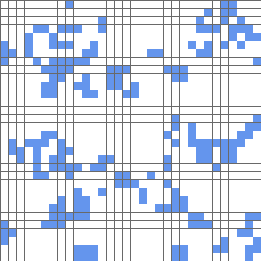

# Language to LLVM IR generator

## Описание
1) Придумать грамматику своего ЯП, ориентируясь на графическое приложение и полученные в предыдущем задании `ISA` и `ASM`. 
2) Написать небольшие тесты для подмножеств полученной грамматики.
3) Реализовать FrontEnd на `FlexBison`/`ANTLR` из ЯП в `LLVM IR`. Поддержать графическое приложение.
4) Подтянуть исполнение на `ExecutionEngine` полученного `LLVM IR` с графической библиотекой.

## Требования к зависимостям
Для корректной работы программы необходимо установить следующие библиотеки:
```bash
antlr4, libantlr4-runtime-dev
```

В Ubuntu может возникнуть проблема версий. По умолчанию установятся `antlr4 v4.10.1` и `antlr4-runtime v4.9.2`. Они не совместимы.

Поэтому в директории `./tools/` находятся две версии `antlr4`: `antlr-4.10.1` и `antlr-4.13.1`. Ориентироваться будем на последнюю версию `4.13.1`.

Установка `antlr4-runtime v4.13.1`:
```powershell
git clone https://github.com/antlr/antlr4.git
cd antlr4
git checkout 4.13.1
cd runtime/Cpp
mkdir build && cd build
cmake .. -DANTLR4_INSTALL=ON -DCMAKE_INSTALL_PREFIX=/usr/local
make -j$(nproc)
sudo make install
sudo ldconfig
cd ../../../../
```

## Генерация парсера и компиляция
В корне проекта есть скрипт `run.sh`, который опционально генерирует парсер и компилирует проект. Для начала выполним:
```powershell
cmake -S ./ -B build/ -DCMAKE_BUILD_TYPE=Release
```

```bash
chmod +x run.sh
```

```powershell
Usage: ./run.sh [MODE]

MODE options (optional):
  --parse    : Only generate parser
  --compile  : Only compile
  --all      : Generate parser and compile (default behavior)

Example:
  ./run.sh              # Generate parser for grammar/lang.g4 and compile
  ./run.sh --parse      # Only generate parser for grammar/lang.g4
  ./run.sh --compile    # Only compile (assume parser already generated)  
```

**Запуск проекта**:
```bash
./build/lang2ir ./test.lang
```


## Ход работы
### 1. Language grammar with ANTLR.

Грамматику для языка, поддерживающего графическое приложение, будем писать итеративно. Всю эволюцию написания грамматики можно проследить в директории `./examples/` — с 1 по 12.6 тесты.

В итоге, грамматика языка имеет такой вид:
```bash
program: funcList EOF;
funcList: funcInit*;

funcInit: 'func' NAME '(' argList? ')' '{' statements '}';
argList: NAME (',' NAME)*;

statements: statement*;
statement: varInit | arrInit | assignment | ifStatement | whileStatement | ( call SEMI ) | returnStatement ;

varInit: 'var' NAME '=' expr SEMI;
arrInit: 'array' NAME '[' INT ']' '[' INT ']' SEMI; 
assignment: (NAME | array) '=' expr SEMI;
ifStatement: 'if' '(' expr ')' '{' statements '}' elseStatement?;
elseStatement: 'else' '{' statements '}';
whileStatement: 'while' '(' expr ')' '{' statements '}';
call: NAME '(' callArgList? ')';
callArgList: expr (',' expr)*;
returnStatement: 'return' expr SEMI;

array: NAME '[' expr ']' '[' expr ']';

expr: 
    '-' expr |
    expr ( '==' | '!=' | '>' | '>=' | '<' | '<=' ) expr |
    expr ( '*' | '/' | '%' ) expr |
    expr ( '+' | '-' ) expr |
    '(' expr ')' |
    array |
    INT |
    NAME |
    call;

SEMI: ';';
NAME: [a-zA-Z][a-zA-Z_0-9]*;
INT: [0-9]+;
WS: [ \t\r\n]+ -> skip;
COMMENT: '//' ~[\r\n]* -> skip;
```

<br>

### 2. Основные конструкции, которые поддерживаются в языке.
  - Так как язык функциональный, можно создавать функции и вызывать их:

    ```cpp
    func foo() {
      // some code
    }

    func app() {
      foo();
      return 0;
    }
    ```
  - Поддерживаются базовые арифметические операции:
    ```cpp
    func foo() {
      return 42;
    }

    func app() {
      var a = 1;
      var b = -x;
      var c = a == b;
      var d = a + b * c;
      var e = (a + b) * c;

      var f = e < foo() + 1;
      var g = foo();

      return 0;
    }
    ```

  - Можно создавать переменные целочисленного типа, присваивать переменным выражения, возвращать переменные из функций:

    ```cpp
    func foo() {
      var x = 42;
      return x + 1;
    }

    func app() {
      var a = 1;
      var b = foo();
      a = b;
      return 0;
    }
    ```
  - Поддерживаются двумерные массивы:

    ```cpp
    func app() {
      array arr1[10][1337];
      array arr2[1337][10];

      var x = 42;
      arr1[1][1] = x;
      arr2[228][1] = arr1[1][1];

      return 0;
    }
    ```
  - Поддерживаются `if` и `if-else` выражения:
    ```cpp
    func foo() {
      return 42;
    }

    func bar() {
      return 52;
    }

    func app() {
      var x = 5;
      var y = 6;

      var out = 0;
      if(x == y) {
        out = foo();
      } else {
        out = bar();
      }

      return 0;
    }
    ```
  - Поддерживаются циклы `while`:
    ```cpp
    func foo() {
      return 42;
    }

    func app() {
      var x = 1;
      var y = 10;

      while(x < y) {
        foo();
        x = x + 1;
      }

      return 0;
    }
    ```

  - Поддерживаются базовые области видимости для переменных и массивов межфункционально и внутри одной функции:
    ```cpp
    func app() {
      var x = 42;
      var x = 52; // [Error] Redeclaration of `var x`

      return 0;
    }
    ```

    ```cpp
    func app() {
      var x = 42;

      // Так нельзя. У переменной x пересекающиеся области видимости.
      if (...) {
        var x = 52; // [Error] Redeclaration of `var x`.
      }

      if (...) {
        // some code
      } else {
        var x = 52; // [Error] Redeclaration of `var x`.
      }

      while (...) {
        var x = 52; // [Error] Redeclaration of `var x`.
      }

      return 0;
    }
    ```

    ```cpp
    func app() {
      if (...) {
        var x = 52;
      }

      var x = 42; // Так можно. У переменной x непересекающиеся области видимости. x из конструкции if уже не существует. Аналогично для if-else, while.

      return 0;
    }
    ```

    ```cpp
    func foo() {
      var x = 42;
    }

    func app() {
      var x = 42; // Так можно. У переменной x непересекающиеся области видимости.
    }
    ```

### 3. Поддержка графического приложения на языке и интерпретация с помощью `ExecutionEngine`.

Запуск приложения:
```bash
./build/lang2ir ./app.lang
```

На выходе получаем игру "Жизнь".

